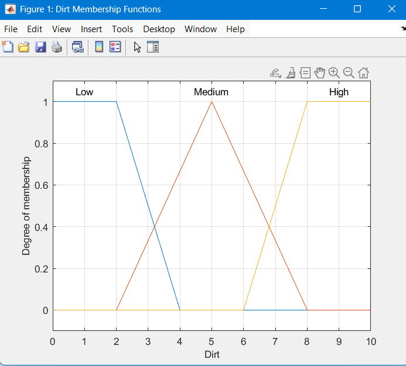
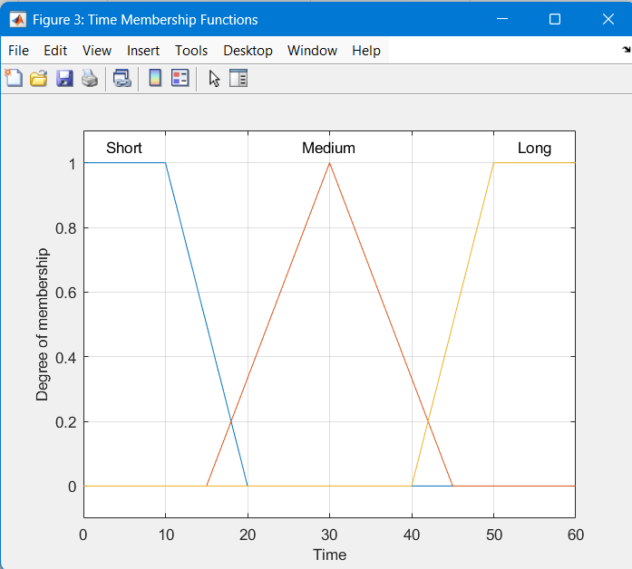
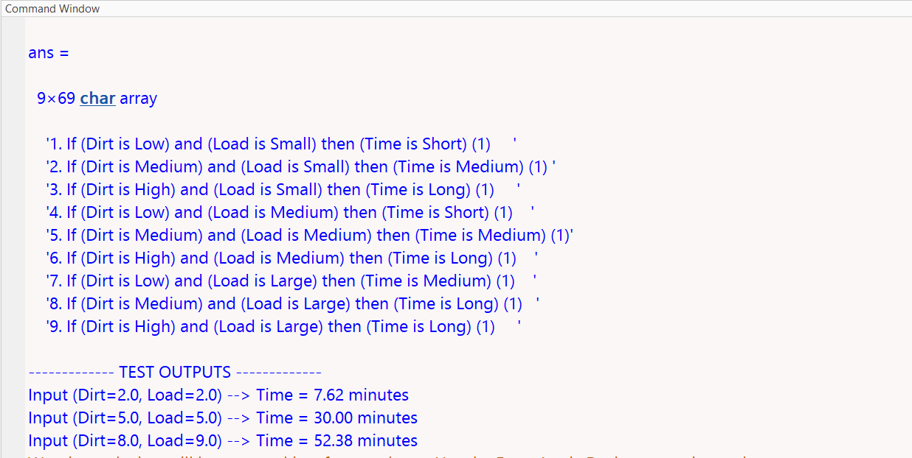

# Fuzzy Logic Washing Machine System

## Overview
This project implements a fuzzy logic system to determine the washing machine cycle time based on dirt level and load size using MATLAB.

## Inputs
- Dirt Level (Low, Medium, High)
- Load Size (Small, Medium, Large)

## Output
- Washing Time (Short, Medium, Long)

## Methodology
- Defined membership functions for inputs and output
- Designed a rule-based system with 9 fuzzy rules
- Implemented using MATLAB Fuzzy Logic Toolbox
- Used Mamdani inference system

## Fuzzy Rules

1. IF Dirt is Low AND Load is Small → Time is Short  
2. IF Dirt is Medium AND Load is Small → Time is Medium  
3. IF Dirt is High AND Load is Small → Time is Long  
4. IF Dirt is Low AND Load is Medium → Time is Short  
5. IF Dirt is Medium AND Load is Medium → Time is Medium  
6. IF Dirt is High AND Load is Medium → Time is Long  
7. IF Dirt is Low AND Load is Large → Time is Medium  
8. IF Dirt is Medium AND Load is Large → Time is Long  
9. IF Dirt is High AND Load is Large → Time is Long  

## Sample Outputs

- Dirt = 2, Load = 2 → Time ≈ 7.62 minutes  
- Dirt = 5, Load = 5 → Time ≈ 30 minutes  
- Dirt = 8, Load = 9 → Time ≈ 52.38 minutes  

## Screenshots

### Membership Functions

  
  
  

### Rule Viewer

### Output

## Tools Used

- MATLAB
- Fuzzy Logic Toolbox

## Author

Sumit Gareri

